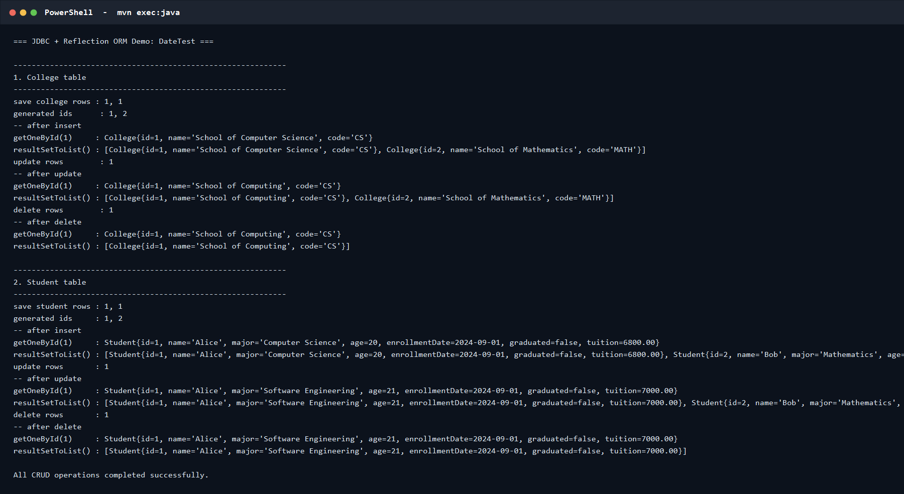

# JDBC ORM 作业：DateTest

本项目完成 JDBC 增删改查、Java 反射 ORM 映射、Maven 构建和 Git 版本管理。

## 1. 技术栈

- Java 17+
- Maven 3.9+
- JDBC
- H2 2.3.232（默认演示数据库，无需单独安装）
- MySQL Connector/J 8.0.33（可通过配置切换）
- JUnit 5

## 2. 数据库设计

数据库名：`DateTest`

学院表 `colleges`：

| 字段 | 类型 | 说明 |
| --- | --- | --- |
| id | INT | 主键，自增 |
| name | VARCHAR(100) | 学院名称 |
| code | VARCHAR(30) | 学院代码，唯一 |

学生表 `students`：

| 字段 | 类型 | 说明 |
| --- | --- | --- |
| id | INT | 主键，自增 |
| name | VARCHAR(100) | 姓名 |
| major | VARCHAR(100) | 专业 |
| age | INT | 年龄 |
| enrollment_date | DATE | 入学时间 |
| graduated | BOOLEAN | 是否毕业 |
| tuition | DECIMAL(10,2) | 学费 |

## 3. ORM 原理

实体类通过 `@Table`、`@Id`、`@Column` 描述表与字段的映射关系。

`JDBCTool` 的核心流程：

1. `ResultSetMetaData` 获取查询结果列名。
2. 根据实体上的注解建立“数据库列 -> Java 字段”映射。
3. 使用 `Class#getDeclaredConstructor()` 创建对象。
4. 使用 `Field#set()` 为对象属性赋值。
5. `save/update/delete/getOneById` 根据实体元数据动态生成 SQL。

## 4. 主要方法

```java
static <T> List<T> resultSetToList(ResultSet rs, Class<T> clazz)
static <T> int save(T obj, Connection connection)
static <T> int update(T obj, Connection connection)
static <T> int delete(T obj, Connection connection)
static <T> T getOneById(String id, Class<T> clazz, Connection connection)
```

## 5. 运行

```bash
mvn clean test
mvn exec:java
```

运行 `mvn exec:java` 后，控制台会依次展示学院表和学生表的插入、查询、更新、删除结果。

## 6. 切换到 MySQL

先创建数据库：

```sql
CREATE DATABASE DateTest DEFAULT CHARACTER SET utf8mb4;
```

然后修改 `src/main/resources/db.properties`：

```properties
jdbc.url=jdbc:mysql://localhost:3306/DateTest?useUnicode=true&characterEncoding=UTF-8&serverTimezone=Asia/Shanghai
jdbc.username=root
jdbc.password=你的密码
```

也可以通过环境变量覆盖，无需修改源码：

```powershell
$env:DB_URL="jdbc:mysql://localhost:3306/DateTest?useUnicode=true&characterEncoding=UTF-8&serverTimezone=Asia/Shanghai"
$env:DB_USERNAME="root"
$env:DB_PASSWORD="你的密码"
mvn exec:java
```

## 7. 项目结构

```text
src/main/java/com/example/jdbc
├── annotation
│   ├── Column.java
│   ├── Id.java
│   └── Table.java
├── entity
│   ├── College.java
│   └── Student.java
├── util
│   ├── DatabaseConfig.java
│   ├── DatabaseInitializer.java
│   └── JDBCTool.java
└── CrudDemo.java
```

## 8. 运行截图



## 9. 仓库地址

本地 Git 仓库：`D:\java作业`

远程仓库尚未配置时，可执行：

```bash
git remote add origin <仓库URL>
git branch -M main
git push -u origin main
```
